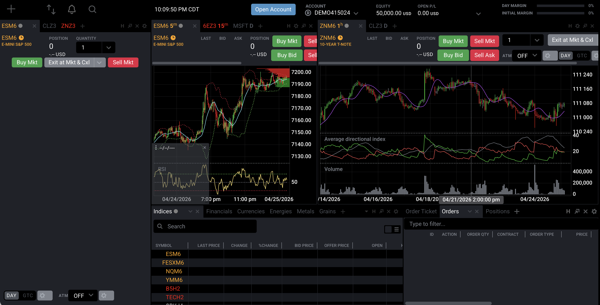
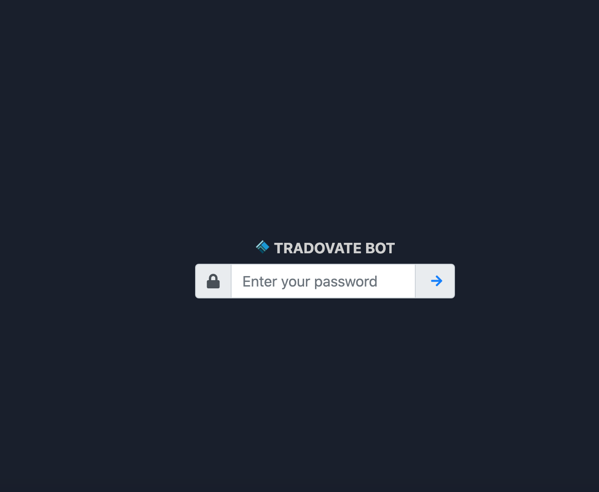
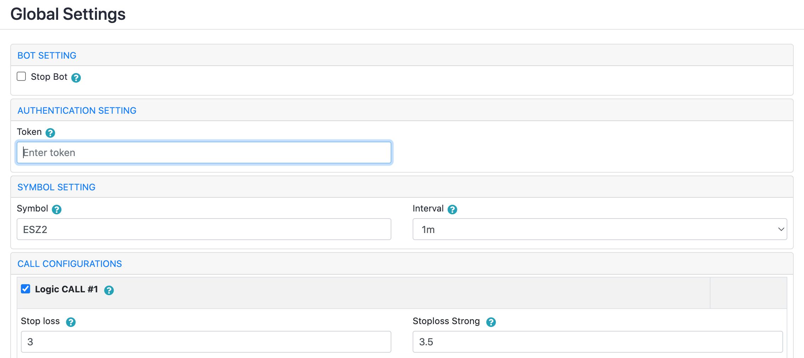
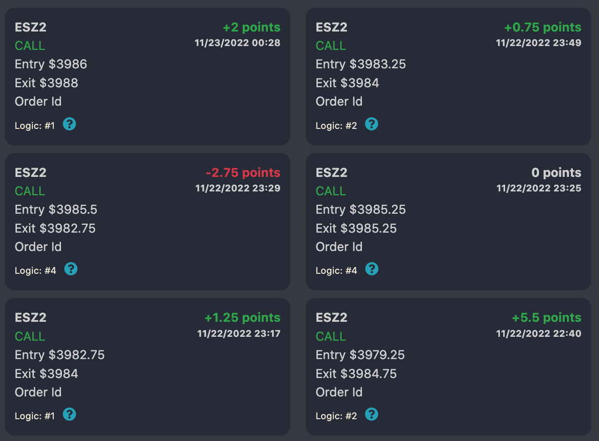

# Tradovate Trading Bot

An automated futures trading bot that connects to [Tradovate](https://tradovate.com) via API and WebSocket, receives signals from TradingView, and executes trades using a grid strategy — with a real-time React dashboard for monitoring and configuration.

---

## Dashboard



The dashboard provides a live view of your account: candlestick chart, strategy performance metrics, open positions, and execution logs — all updating in real time.

**Strategy Performance metrics:**
- Win Rate, Max Drawdown, Risk/Reward, Profit Factor
- Sharpe Ratio, Average Win, Average Loss, Expectancy

**Active Positions table:**
- Symbol, direction (LONG/SHORT), contracts, entry price, current price, unrealized P&L

**Execution Logs panel:**
- Timestamped INFO / WARN / ERROR entries from every strategy step

---

## Login



Secure password-protected access. Enable or disable authentication via the `TRADOVATE_AUTHENTICATION_ENABLED` environment variable.

---

## Settings



Adjust all strategy parameters from the UI without restarting the bot:

| Section | Options |
|---------|---------|
| Bot Setting | Enable/disable auto-trading, select active symbol |
| Authentication | Tradovate demo/live credentials |
| Symbol Setting | Timeframe, contract (e.g. ESZ2 / 1m) |
| Call Configurations | Logic #1/#2, Stop Loss, Stop Loss Strong, Point In |

---

## Trade History



Browse closed trades with entry/exit prices, P&L in points and dollars, and the logic gate that triggered the trade (Logic #1, #2, #4).

---

## Features

- **Automated trading** — Executes buy/sell orders based on TradingView signals (`BUY`, `SELL`, `STRONG_BUY`, `STRONG_SELL`)
- **Grid trading strategy** — Multiple entry/exit levels with configurable stop-loss percentages
- **Technical indicators** — WMA, RSI, CrossUp, CrossDown signal confirmation
- **Trailing stop-loss** — Configurable max loss protection per trade
- **Real-time candlestick chart** — Live OHLCV bars via WebSocket, powered by `lightweight-charts`
- **Strategy configuration** — Change all parameters from the UI without restarting
- **Slack notifications** — Alerts for order confirmations and executions
- **Job monitoring** — Built-in Bull Board for queue inspection at `/bull-board`
- **Local tunnel support** — Expose bot publicly to receive TradingView webhook alerts

## Supported Contracts

| Symbol | Description |
|--------|-------------|
| ES | E-mini S&P 500 |
| NQ | E-mini Nasdaq-100 |
| MES | Micro E-mini S&P 500 |
| MNQ | Micro E-mini Nasdaq-100 |

## Tech Stack

| Layer | Technology |
|-------|-----------|
| Backend | Node.js, Express.js, Bull queue, WebSocket, Bunyan |
| Database | PostgreSQL (trade history, logs, strategy config) |
| Cache | Redis + Redlock (market data, account state, locks) |
| Frontend | React 18, TypeScript, Vite, TailwindCSS, Radix UI |
| Charts | `lightweight-charts` (TradingView library) |
| Data fetching | React Query (TanStack Query v5) |

---

## Requirements

- Node.js 18+ and npm 9+ (for local dev)
- PostgreSQL 14+ and Redis 6+ (or Docker)
- A [Tradovate](https://tradovate.com) account (demo or live)
- A [TradingView](https://tradingview.com) account for signal alerts (optional)

---

## Quick Start (Local)

### 1. Clone and configure

```bash
git clone https://github.com/dearvn/tradovate-trading-bot.git
cd tradovate-trading-bot
cp .env.example .env
```

Edit `.env` with your credentials:

```env
# Tradovate mode: "local" (demo) or "production" (live)
TRADOVATE_MODE=local

# Demo app credentials (from Tradovate API Management)
TRADOVATE_DEMO_APP_ID=your_app_id
TRADOVATE_DEMO_APP_VERSION=1.0
TRADOVATE_DEMO_CID=your_cid
TRADOVATE_DEMO_SECRET=your_secret

# Demo account credentials
TRADOVATE_DEMO_USERNAME=your_username
TRADOVATE_DEMO_PASSWORD=your_password

# UI login
TRADOVATE_AUTHENTICATION_ENABLED=true
TRADOVATE_AUTHENTICATION_PASSWORD=admin123
```

### 2. Run locally

```bash
bash run_local.sh
```

This script will:
1. Check for Node.js, PostgreSQL, and Redis
2. Install all npm dependencies
3. Create the PostgreSQL role and database if missing
4. Run database migrations
5. Seed initial data
6. Start the backend and frontend dev servers

Access the dashboard at **http://localhost:3000** (default password: `admin123`)

---

## Quick Start (Docker)

```bash
docker-compose build
docker-compose up -d
```

Access the dashboard at **http://localhost:8086**

---

## Environment Variables

| Variable | Description | Default |
|----------|-------------|---------|
| `TRADOVATE_MODE` | `local` (demo) or `production` (live) | `local` |
| `TRADOVATE_DEMO_APP_ID` | Demo app ID from Tradovate | — |
| `TRADOVATE_DEMO_CID` | Demo client ID | — |
| `TRADOVATE_DEMO_SECRET` | Demo client secret | — |
| `TRADOVATE_DEMO_USERNAME` | Tradovate account email | — |
| `TRADOVATE_DEMO_PASSWORD` | Tradovate account password | — |
| `TRADOVATE_LIVE_APP_ID` | Live app ID | — |
| `TRADOVATE_LIVE_CID` | Live client ID | — |
| `TRADOVATE_LIVE_SECRET` | Live client secret | — |
| `TRADOVATE_LIVE_USERNAME` | Live account email | — |
| `TRADOVATE_LIVE_PASSWORD` | Live account password | — |
| `TRADOVATE_AUTHENTICATION_ENABLED` | Enable UI login | `true` |
| `TRADOVATE_AUTHENTICATION_PASSWORD` | UI login password | — |
| `TRADOVATE_SLACK_ENABLED` | Enable Slack alerts | `false` |
| `TRADOVATE_SLACK_WEBHOOK_URL` | Slack incoming webhook URL | — |
| `TRADOVATE_LOCAL_TUNNEL_ENABLED` | Expose via local tunnel | `false` |
| `TRADOVATE_LOCAL_TUNNEL_SUBDOMAIN` | Custom tunnel subdomain | — |
| `TRADOVATE_POSTGRES_HOST` | PostgreSQL host | `postgres` |
| `TRADOVATE_POSTGRES_DATABASE` | Database name | `tradovate` |

---

## TradingView Integration

1. Enable local tunnel in `.env` (`TRADOVATE_LOCAL_TUNNEL_ENABLED=true`) or expose port 8086 publicly
2. In TradingView, create an alert with webhook URL pointing to your bot
3. Set the alert message body to one of:

```json
{ "symbol": "ES", "action": "BUY" }
{ "symbol": "ES", "action": "SELL" }
{ "symbol": "NQ", "action": "STRONG_BUY" }
{ "symbol": "NQ", "action": "STRONG_SELL" }
```

The bot maps signal strength to grid logic levels: `BUY`/`SELL` → Logic #1, `STRONG_BUY`/`STRONG_SELL` → Logic #2.

---

## API Endpoints

| Method | Path | Description |
|--------|------|-------------|
| `GET` | `/api/healthz` | Health check |
| `GET` | `/api/dashboard/summary` | Account balance, positions, daily P&L |
| `GET` | `/api/positions` | Open positions |
| `DELETE` | `/api/positions/:id` | Close a position |
| `GET` | `/api/strategy` | Current strategy configuration |
| `PUT` | `/api/strategy` | Update strategy settings |
| `GET` | `/api/strategy/performance` | Win rate, drawdown, Sharpe, expectancy |
| `GET` | `/api/trades` | Trade history |
| `GET` | `/api/logs` | Application logs |
| `GET` | `/api/bars` | OHLCV bars for chart (Redis cache) |
| `POST` | `/auth/login` | Authenticate (returns JWT) |
| `GET` | `/bull-board` | Bull queue monitor |

---

## Development

```bash
# Install all dependencies
npm install && cd frontend && npm install && cd ..

# Start backend with hot reload
npm run dev

# Start frontend dev server (separate terminal)
cd frontend && npm run dev

# Run backend tests
npm test

# Database migrations
npm run migrate:up
npm run migrate:down

# Seed development data
node scripts/seed.js
```

---

## Docker Commands

```bash
# Build and start all services
docker-compose build && docker-compose up -d

# View logs
docker-compose logs -f

# Stop all services
docker-compose down

# Stop and remove all volumes (destructive)
docker-compose down -v
```

---

## Project Structure

```
tradovate-trading-bot/
├── app/
│   ├── server.js                    # Main entry point
│   ├── server-tradovate.js          # WebSocket connection to Tradovate
│   ├── server-cronjob.js            # Trading job scheduler
│   ├── server-frontend.js           # Express API + static file server
│   ├── tradovate/                   # Tradovate REST + WebSocket client
│   ├── cronjob/
│   │   ├── trailingTradeHelper/     # Core strategy logic (grid, stop-loss)
│   │   └── trailingTradeIndicator/  # WMA, RSI, CrossUp, CrossDown, token refresh
│   ├── frontend/
│   │   ├── webserver/               # REST API route handlers
│   │   └── bull-board/              # Job queue monitor UI
│   └── helpers/                     # cache.js, postgres.js, logger.js, slack.js
├── frontend/                        # React dashboard (Vite + TypeScript)
│   └── src/
│       ├── pages/                   # Dashboard, TradeHistory, Settings, Logs
│       ├── components/              # CandlestickChart, PositionsTable, LogsPanel
│       └── hooks/                   # useChartData, useMarketData, useDashboard
├── config/                          # Strategy defaults (default.json)
├── migrations/                      # PostgreSQL schema migrations
├── scripts/
│   └── seed.js                      # Development seed data
├── run_local.sh                     # Local dev startup script
├── docker-compose.yml
└── .env.example
```

---

## Roadmap

### v1.x — Current
- [x] Tradovate OAuth + direct auth
- [x] WebSocket real-time market data
- [x] Grid trading strategy with configurable stop-loss
- [x] TradingView signal integration
- [x] WMA, RSI, CrossUp, CrossDown indicators
- [x] PostgreSQL trade/order persistence
- [x] Redis caching + Redlock distributed locks
- [x] Bull job queue with monitoring UI
- [x] Live candlestick chart (lightweight-charts)
- [x] Strategy performance metrics (Sharpe, drawdown, expectancy)
- [x] Trade history and execution logs
- [x] Strategy settings UI (live config without restart)
- [x] Slack notifications
- [x] JWT authentication with rate limiting
- [x] Local tunnel for TradingView webhooks
- [x] Docker Compose deployment

### v2.0 — Strategy & Reliability
- [ ] Contract auto-rotation (ESZ2 → ESH3 on expiry)
- [ ] Backtesting engine — replay historical candles against current strategy
- [ ] Paper trading mode — simulate without placing real orders
- [ ] Additional indicators: MACD, Bollinger Bands, EMA, VWAP
- [ ] Multi-symbol side-by-side dashboard
- [ ] Trailing stop as price distance, not fixed percentage

### v2.1 — Notifications & Observability
- [ ] Telegram / Discord alerts
- [ ] Daily P&L email summary
- [ ] Equity curve chart
- [ ] Trade journaling with CSV export
- [ ] Alert on WebSocket connection loss

### v2.2 — Multi-Account & Security
- [ ] Multi-account management
- [ ] Role-based access (read-only viewer vs. admin)
- [ ] Audit log for config changes
- [ ] TOTP two-factor authentication

---

> Feature requests and contributions welcome — open an issue or PR.

## License

MIT
